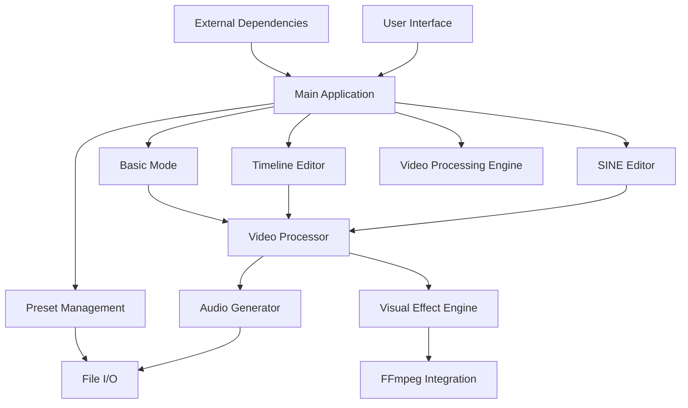

# IsoFlicker Pro Documentation

## Overview

IsoFlicker Pro is an enhanced brainwave entrainment tool that combines audio isochronic tone generation with video processing capabilities. The application allows users to create complex entrainment sessions with precise control over frequency transitions, carrier waves, modulation patterns, and visual effects synchronized with audio.

## Table of Contents

1. [Architecture](#architecture)
2. [Core Components](#core-components)
3. [Installation](#installation)
4. [Usage](#usage)
5. [API Documentation](#api-documentation)
6. [Testing](#testing)
7. [Contributing](#contributing)

## Architecture

### System Components



### Technology Stack

- **Frontend**: Python with PyQt5 for GUI
- **Backend**: Python for audio/video processing logic
- **Audio Processing**: 
  - librosa for audio analysis
  - soundfile for audio I/O
  - numpy for signal processing
- **Video Processing**: 
  - moviepy for video editing
  - OpenCV for frame manipulation
  - FFmpeg for encoding/decoding
- **Dependencies**: 
  - PyQt5 for UI components
  - scipy for scientific computing
  - simpleaudio/sounddevice for audio playback

## Core Components

### Video Processor

The [video_processor.py](file:///C:/Users/kerte/OneDrive/Desktop/AI_Projects/IsoFlicker/core/video_processor.py) module contains the base video processing functionality:

- `BaseVideoProcessor`: Base class for video processing with isochronic entrainment effects
- `generate_isochronic_tone`: Function to generate isochronic tones
- `detect_isochronic_frequency`: Function to detect isochronic frequencies from audio files

### Enhanced Video Processor

The [enhanced_video_processor.py](file:///C:/Users/kerte/OneDrive/Desktop/AI_Projects/IsoFlicker/core/enhanced_video_processor.py) module contains enhanced video processing functionality:

- `EnhancedVideoProcessor`: Enhanced video processor with SINE presets, custom audio, and advanced visual effects
- `_apply_text_overlays`: Function to apply text overlays to video frames

### Advanced Isochronic Generator

The [advanced_isochronic_generator.py](file:///C:/Users/kerte/OneDrive/Desktop/AI_Projects/IsoFlicker/advanced_isochronic_generator.py) module contains advanced isochronic tone generation functionality:

- `IsochronicToneGenerator`: Advanced generator for isochronic tones with various carrier and modulation options
- `WaveformType`: Enumeration of supported waveform types for carrier waves
- `ModulationType`: Enumeration of supported modulation types for isochronic tones

## Installation

### Prerequisites

- Python 3.7 or higher
- FFmpeg
- Java Runtime (for SINE Editor components)

### Installing Dependencies

```bash
pip install -r requirements.txt
```

### Running the Application

```bash
python isoFlickerGUI.py
```

## Usage

### Basic Mode

The Basic Mode provides a simple interface for applying entrainment effects to videos:

1. Select a video file
2. Configure audio and visual entrainment settings
3. Process the video

### Timeline Editor

The Timeline Editor allows segment-based session creation with transitions:

1. Create segments with different entrainment frequencies
2. Configure transitions between segments
3. Process the video with the timeline

### SINE Editor

The SINE Editor provides graph-based precise frequency curve editing:

1. Edit frequency curves using control points
2. Configure carrier wave and modulation settings
3. Process the video with the SINE preset

## API Documentation

### Video Processor API

#### BaseVideoProcessor

```python
class BaseVideoProcessor(QThread):
    def __init__(self, video_path, output_path, mode, config):
        # Initialize the video processor
        pass
    
    def process_video(self):
        # Process the video with isochronic entrainment effects
        pass
```

#### generate_isochronic_tone

```python
def generate_isochronic_tone(frequency, duration, sample_rate=44100, volume=0.5, carrier_frequency=100.0):
    """
    Generate an isochronic tone at the specified frequency and duration
    
    Args:
        frequency (float): The entrainment frequency in Hz
        duration (float): The duration of the tone in seconds
        sample_rate (int): The sample rate of the audio
        volume (float): The volume of the tone (0.0 to 1.0)
        carrier_frequency (float): The carrier frequency in Hz
        
    Returns:
        tuple: (audio_data, sample_rate)
    """
    pass
```

#### detect_isochronic_frequency

```python
def detect_isochronic_frequency(audio_path):
    """
    Detect the isochronic frequency from an audio file
    
    Args:
        audio_path (str): Path to the audio file
        
    Returns:
        float: Detected frequency in Hz
    """
    pass
```

### Enhanced Video Processor API

#### EnhancedVideoProcessor

```python
class EnhancedVideoProcessor(QThread):
    def __init__(self, video_path, output_path, mode, config, isochronic_audio=None):
        # Initialize the enhanced video processor
        pass
    
    def process_video(self):
        # Process the video with enhanced features
        pass
```

### Advanced Isochronic Generator API

#### IsochronicToneGenerator

```python
class IsochronicToneGenerator:
    def __init__(self, sample_rate=44100):
        # Initialize the tone generator
        pass
    
    def generate_carrier(self, waveform_type, frequency, duration, amplitude=1.0):
        # Generate carrier wave with specified waveform type
        pass
    
    def generate_modulation(self, mod_type, frequency, duration, duty_cycle=0.5, ramp_percent=10):
        # Generate modulation envelope with specified type
        pass
    
    def generate_tone_segment(self, duration, carrier_freq, entrainment_freq, volume=0.5, 
                             sample_rate=44100, carrier_type=WaveformType.SINE, 
                             modulation_type=ModulationType.SQUARE, duty_cycle=0.5):
        # Generate a segment of isochronic tone with the specified parameters
        pass
```

## Testing

### Running Tests

To run the test suite, execute:

```bash
python run_tests.py
```

### Test Structure

The test suite is organized as follows:

- `tests/test_video_processor.py`: Tests for the base video processor
- `tests/test_advanced_isochronic_generator.py`: Tests for the advanced isochronic generator

## Contributing

### Code Style

Follow PEP 8 guidelines for Python code style.

### Testing

All new functionality should include appropriate unit tests.

### Documentation

All new functionality should include appropriate documentation.